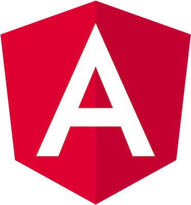

# Fullstack

This project was generated using [Nx](https://nx.dev).

<p></p>

| **DB** (Postgres)                                         | **API** (Nestjs)                                        | **PWA** (angular)                                        |
| --------------------------------------------------------- | ------------------------------------------------------- | -------------------------------------------------------- |
|  |  |  |

## Objectives

### Monorepo functionalities

- [x] Angular PWA + Nestjs API, in one repository
- [x] Pre-commit hooks with Husky & Lint-Staged :
  - [x] TSlint Typescript linting
  - [x] Prettier code formatting
  - [x] StyleLint Scss linting (stylelint-config-sass-guidelines)
- [x] one .env file for Pwa & Api, run `npm run set-env` to update prduction & development environment.ts files
- [x] run all the stack in containers with docker-compose
- [ ] code documentation for PWA & API with compodoc

### Pwa functionalities

- [x] is a Progressive Web Application (Lighthouse checked)
- [x] follow Material design guidelines, responsive...
- [x] Dynamic color themes :
  - [x] Without DOM usage : Dark/light mode
  - [x] With DOM usage : Many color themes, can be defined on runtime (color picker, api response...)
- [ ] User authentication system :
  - [ ] sign up, sign in, jwt authentication
  - [ ] email confirmation
  - [ ] user can update his informations
  - [ ] user can upload his profile avatar (image resized, progressive encoding)

### Api functionalities

- [x] Postgres DB connected to Nestjs API, with TypeORM
- [x] switch from Express to Fastify for better performances
- [x] Apollo Graphql implementation
- [x] Graphql <-> Typescript automations :
  - [x] GraphQL Schema generated from Api TypeORM classes
  - [x] Typescript interfaces (_generated.ts_ shared with frontend app) generated from GraphQL Schema
- [ ] User authentication system :
  - [ ] sign up, sign in, jwt authentication
  - [ ] email confirmation
  - [ ] user can update his informations
  - [ ] user can upload his profile avatar (image resized, progressive encoding)

## How to test the stack

### Dev environment

```bash
# install dependencies
npm i
# run Postgres Database in container
npm run db
# run Nest Application Programming Interface
npm run api
# run Angular Progressive Web App
npm run pwa
```

> run API will automatically update 'schema.gql' according to ORM entities & DTO

```bash
# update all 'environment.ts' variables according to .env file
npm run set-env
# update Typescript shared interfaces according to schema.gql file
npm run codegen
```

### Prod environment

```bash
# install dependencies
npm i
# build all apps in prod mode
npm run release
# run all apps in containers
npm run containers
```

## How to make this monorepo yours

```bash
# clone this project and rename it
git clone https://github.com/mIaborde/fullstack your-project-name
# reset git history
rm -rf .git && git init
```

- Change `PUBLIC_ALL_APP_NAME` variable in **.env** file, `"name"` in **package.json**, and `npmScope` **nx.json**
- adapt **.env** to your needs and you are good to go
